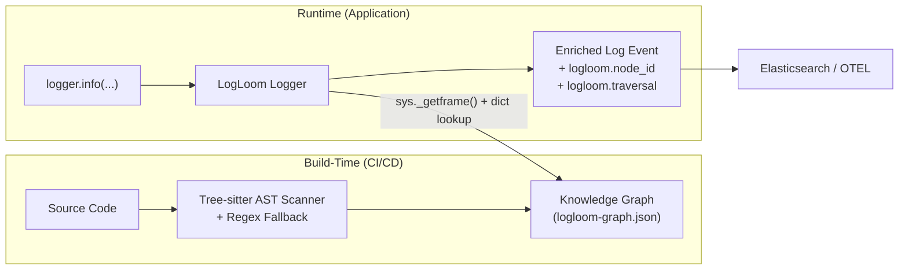

# LogLoom Architecture

## Core Philosophy
**Build-time intelligence, runtime simplicity.**

LogLoom separates heavy AST analysis (build/CI) from lightweight log emission (runtime) to deliver semantic provenance with **zero production overhead**.

## Two-Phase Design

### Build Phase (`logloom build`)
- Tree-sitter + regex scan of source
- Hybrid stable node ID generation
- Semantic tag inference
- Graph construction (`logloom-graph.json`)
- Git metadata + redaction

### Runtime Phase
- `get_logger()` wrapper (structlog compatible)
- Fast `NodeResolver` (exact → fuzzy lookup)
- Graceful degradation if graph missing
- Enriched events with `ll_node`, tags, etc.

## Milestone 2 Additions
- Automatic semantic tags
- `logloom graph stats/show`
- `logloom lint`
- Enhanced lexical context

See the code in `src/logloom/` for implementation details.