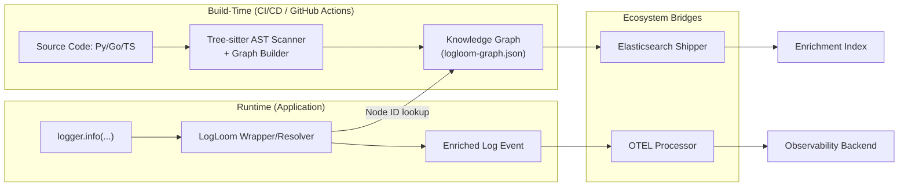

# LogLoom Architecture

## Core Philosophy
**Build-time intelligence, runtime simplicity.**

LogLoom separates heavy AST analysis (build/CI) from lightweight log emission (runtime) to deliver semantic provenance with **zero production overhead**.

## Two-Phase Design

### Build Phase (`logloom build`)
- **Multi-Language Tree-sitter Scanners**: Python, Go, and TypeScript/JavaScript supported natively. Parses the AST looking for standard and third-party logging calls (e.g., `structlog`, `slog`, `zap`, `zerolog`, `logrus`, `pino`, `winston`, `bunyan`, `log4js`).
- Hybrid stable node ID generation.
- Semantic tag inference and control flow extraction (`try/catch`, closures, goroutines).
- Graph construction (`logloom-graph.json`).
- Git metadata + redaction.

### Runtime Phase
- `get_logger()` wrapper (structlog compatible) for pure Python flows.
- Fast `NodeResolver` (exact → fuzzy lookup) for patching external logs.
- Graceful degradation if the graph is missing (zero runtime panic).
- Enriched events with `ll_node`, tags, and lexical context.

## Milestone 2 Intelligence Layer Additions

Milestone 2 upgraded the build-time graph with a post-processing intelligence layer:

- **Semantic Tag Engine**: Pure function (`infer_tags`) that auto-detects 13 domain categories (`auth`, `database`, `payment`, `retry`, `lifecycle`, etc.) from function names, module paths, decorators, message content, and log levels.
- **Inter-Function Call-Graph Edges**: Tree-sitter AST walker builds a full `caller → {callees}` map, populating `call_parents` and `call_children` on graph nodes.
- **Git Metadata**: Automatically embeds the local git repository's `commit_sha` and `branch` into graph metadata.
- **Graph Explorer CLI**:
  - `logloom graph stats` — High-level insights, tag/level distributions.
  - `logloom graph show` — Tree representation of nodes mapped to modules/functions.
  - `logloom graph find` — Search node messages and locations.
- **Graph Validation CLI**:
  - `logloom lint` — Checks source files against the graph to detect untracked or stale log sites (supports `--strict` for CI gating).
  - `logloom diff` — Detects added/removed/moved/modified graph nodes across two versions.

See the code in `src/logloom/` for implementation details.

## Milestone 3 Ecosystem Bridges

Milestone 3 jacked the LogLoom core directly into the global observability backbone:

- **Elasticsearch Shipper & Mappings**:
  - `mapping.py`: Generates ECS-compliant component and index templates (e.g., `logloom-mappings.json`). Maps our rich context (like `ll.lexical.in_loop`) to proper ELK datatypes.
  - `shipper.py`: Compiles the `logloom-graph.json` into an NDJSON payload ready for Elasticsearch's `_bulk` API. Perfect for creating a standalone "Enrichment Index" that Logstash or Ingest Pipelines can query.
- **OpenTelemetry Native Processor**:
  - `bridge.py`: Implements `LogLoomProcessor` for the OTEL Python SDK. It intercepts every `LogRecord` generated by standard OTEL logging handlers, resolves the caller via `NodeResolver`, and attaches `logloom.node_id` and semantic tags directly to the span's Resource Attributes.
- **Multi-Language AST Mastery**:
  - `go_scanner.py`: Hardened Go parser. Handles `zerolog` method chains by walking backwards, qualifies method receivers (`Server.HandleAuth`), and flattens `fmt.Sprintf` and string concatenations.
  - `ts_scanner.py`: Hardened TypeScript/JS parser. Understands `try/catch` contexts, async closures, class methods, and template literals.
- **GitHub Actions Integration**:
  - Ready to drop into your pipeline like a dial-up modem auto-dialing the BBS. `uses: fremenlabs/logloom@v0.3.0` builds the graph and tests it continuously.

## Milestone 4 Deep Static Context and CI Quality Gates

Milestone 4 introduces deep static typing context, coverage metrics, and strict quality gate enforcement for CI pipelines:

- **Resolved Call Targets & Name Collision Mitigation**: Qualifies call targets and data model dictionaries (`module.function` and `module.model`) to prevent name collisions in larger codebases.
- **Function Signatures**: Extracts parameter names, type hints, defaults, decorators, and return types from enclosing functions.
- **Data Model Extraction**: Parses classes, interfaces, and struct definitions to capture attributes, type definitions, defaults, and inheritance hierarchies.
- **Import Graph & Filtering**: Maps internal module dependencies while filtering out external or stdlib modules by default to keep the dependency graph clean.
- **Log Coverage & CI Gates**:
  - Computes exact log coverage (percentage of functions with log sites).
  - Prints uninstrumented functions in `logloom graph stats` to identify gaps.
  - Integrates `--min-coverage <pct>` to automatically fail the build/CI pipeline when log coverage is below the threshold.