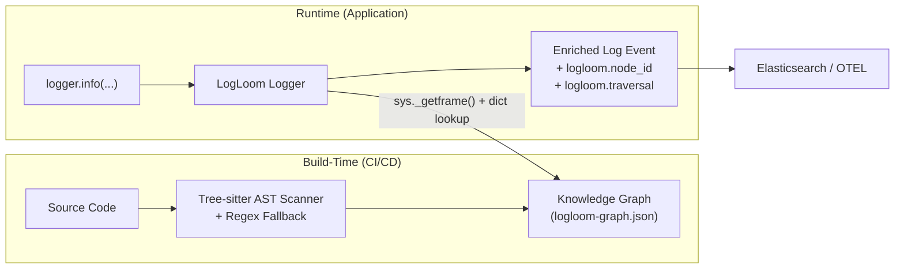

# LogLoom Architecture

## Core Philosophy
**Build-time intelligence, runtime simplicity.**

LogLoom separates heavy AST analysis (build/CI) from lightweight log emission (runtime) to deliver semantic provenance with **zero production overhead**.

## Two-Phase Design

### Build Phase (`logloom build`)
- Tree-sitter + regex scan of source
- Hybrid stable node ID generation
- Semantic tag inference
- Graph construction (`logloom-graph.json`)
- Git metadata + redaction

### Runtime Phase
- `get_logger()` wrapper (structlog compatible)
- Fast `NodeResolver` (exact → fuzzy lookup)
- Graceful degradation if graph missing
- Enriched events with `ll_node`, tags, etc.

## Milestone 2 Intelligence Layer Additions

Milestone 2 upgraded the build-time graph with a post-processing intelligence layer:

- **Semantic Tag Engine**: Pure function (`infer_tags`) that auto-detects 13 domain categories (`auth`, `database`, `payment`, `retry`, `lifecycle`, etc.) from function names, module paths, decorators, message content, and log levels.
- **Inter-Function Call-Graph Edges**: Tree-sitter AST walker builds a full `caller → {callees}` map, populating `call_parents` and `call_children` on graph nodes.
- **Git Metadata**: Automatically embeds the local git repository's `commit_sha` and `branch` into graph metadata.
- **Graph Explorer CLI**:
  - `logloom graph stats` — High-level insights, tag/level distributions.
  - `logloom graph show` — Tree representation of nodes mapped to modules/functions.
  - `logloom graph find` — Search node messages and locations.
- **Graph Validation CLI**:
  - `logloom lint` — Checks source files against the graph to detect untracked or stale log sites (supports `--strict` for CI gating).
  - `logloom diff` — Detects added/removed/moved/modified graph nodes across two versions.

See the code in `src/logloom/` for implementation details.