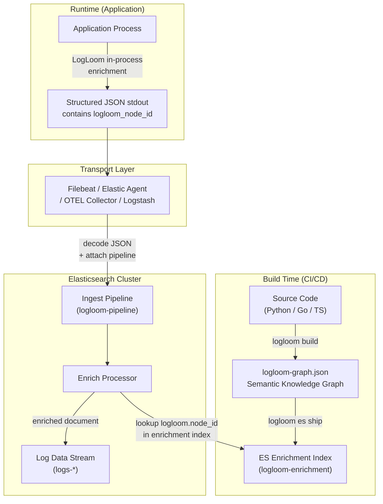
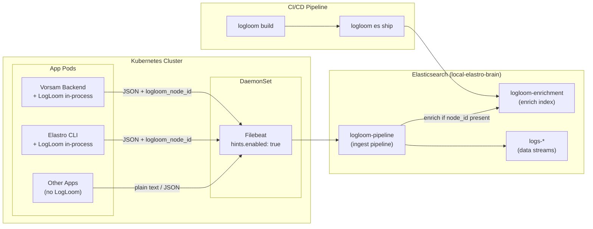

# How to Integrate with Elastic Beats & OTEL

## Executive Summary

Any application that integrates LogLoom's in-process enrichment (Python, Go, or TypeScript) will emit `logloom_node_id` and semantic metadata in its structured JSON log output. **Every Elastic Beat or agent-based transport** that captures that structured output and ships it to Elasticsearch can leverage LogLoom's server-side enrich processor — provided the JSON is decoded and the ingest pipeline is attached.

This document maps out every major Elastic data collection path and how LogLoom's architecture slots into each.

---

## The Universal Pattern

Regardless of transport mechanism, the LogLoom integration always follows the same two-phase architecture:



> [!IMPORTANT]
> **The transport layer is completely decoupled from the enrichment logic.** LogLoom doesn't care how the log gets to Elasticsearch — only that the JSON is parsed and the ingest pipeline is triggered.

---

## Transport-by-Transport Analysis

### 1. Filebeat — Docker Container Input

**Deployment**: DaemonSet on Docker hosts, tails `json-file` driver output.

| Aspect | Detail |
|---|---|
| **Input type** | `container` or `filestream` |
| **JSON decoding** | `decode_json_fields` processor OR `json.keys_under_root: true` |
| **Pipeline attachment** | `output.elasticsearch.pipeline: "logloom-pipeline"` |
| **LogLoom compatible** | ✅ Yes |

**Config snippet:**
```yaml
filebeat.inputs:
  - type: container
    paths:
      - '/var/lib/docker/containers/*/*.log'
    processors:
      - decode_json_fields:
          fields: ["message"]
          target: ""
          overwrite_keys: true
      - add_docker_metadata:
          host: "unix:///var/run/docker.sock"

output.elasticsearch:
  hosts: ["https://local-elastro-brain:9200"]
  pipeline: "logloom-pipeline"
```

**What LogLoom adds on top of Docker metadata:**

| Without LogLoom | With LogLoom |
|---|---|
| `container.name: "vorsam-backend"` | `container.name: "vorsam-backend"` |
| `message: "User login failed"` | `message: "User login failed"` |
| — | `logloom.node_id: "ll:abc123"` |
| — | `logloom.module: "src/routes/auth"` |
| — | `logloom.function: "authenticate"` |
| — | `logloom.file: "src/routes/auth.ts"` |
| — | `logloom.tags: ["auth", "security"]` |
| — | `logloom.call_parents: ["validateToken"]` |
| — | `logloom.commit_sha: "bba435c3"` |

---

### 2. Filebeat — Kubernetes Autodiscovery (Hints-Based)

**Deployment**: DaemonSet across all K8s nodes, with `hints.enabled: true`.

This is the **most powerful** integration point because Kubernetes pod annotations control per-container behavior.

| Aspect | Detail |
|---|---|
| **Input type** | `filestream` via `kubernetes` autodiscovery provider |
| **JSON decoding** | Pod annotations: `co.elastic.logs/json.keys_under_root: "true"` |
| **Pipeline attachment** | Pod annotation: `co.elastic.logs/pipeline: "logloom-pipeline"` |
| **LogLoom compatible** | ✅ Yes — annotation-driven, zero Filebeat config changes |

**Pod manifest with LogLoom-aware annotations:**
```yaml
apiVersion: apps/v1
kind: Deployment
metadata:
  name: vorsam-backend
spec:
  template:
    metadata:
      annotations:
        # ── LogLoom-aware Filebeat hints ──────────────────────
        co.elastic.logs/enabled: "true"
        co.elastic.logs/json.keys_under_root: "true"
        co.elastic.logs/json.add_error_key: "true"
        co.elastic.logs/json.message_key: "message"
        co.elastic.logs/pipeline: "logloom-pipeline"
    spec:
      containers:
        - name: backend
          image: vorsam/backendv2:1.4.0
          env:
            - name: LOGLOOM_ENABLED
              value: "true"
            - name: LOGLOOM_GRAPH_PATH
              value: "/app/logloom-graph.json"
```

**Filebeat DaemonSet config:**
```yaml
filebeat.autodiscover:
  providers:
    - type: kubernetes
      node: ${NODE_NAME}
      hints.enabled: true
      hints.default_config:
        type: filestream
        id: kubernetes-container-logs-${data.kubernetes.pod.name}-${data.kubernetes.container.name}
        paths:
          - /var/log/containers/*-${data.kubernetes.container.id}.log
```

> [!TIP]
> **This is the killer feature for K8s.** You deploy Filebeat once as a DaemonSet. Then every pod that runs a LogLoom-integrated app simply adds the `co.elastic.logs/pipeline: "logloom-pipeline"` annotation. No Filebeat reconfiguration needed. Non-LogLoom pods (Redis, Nginx, etc.) just omit the annotation and their logs flow through normally.

**Multi-container pods** are also supported. If only one container in a pod uses LogLoom:
```yaml
annotations:
  co.elastic.logs.backend/json.keys_under_root: "true"
  co.elastic.logs.backend/pipeline: "logloom-pipeline"
  co.elastic.logs.nginx-sidecar/pipeline: ""  # no enrichment for nginx
```

---

### 3. Elastic Agent — Fleet-Managed Kubernetes Integration

**Deployment**: DaemonSet managed centrally via Kibana Fleet.

Elastic Agent is Elastic's strategic replacement for standalone Beats. It runs Filebeat under the hood but configuration is managed via Fleet policies in Kibana.

| Aspect | Detail |
|---|---|
| **Integration** | `Kubernetes` integration (container logs) |
| **JSON decoding** | Fleet integration settings: "Decode JSON" toggle |
| **Pipeline attachment** | Custom ingest pipeline: `logs-kubernetes.container@custom` |
| **LogLoom compatible** | ✅ Yes — via `@custom` pipeline hook |

**How it works:**
1. Deploy Elastic Agent as a DaemonSet via Fleet
2. Add the **Kubernetes** integration to the agent policy
3. Create an ingest pipeline named `logs-kubernetes.container@custom` in Kibana:

```json
{
  "description": "LogLoom enrichment for Kubernetes container logs",
  "processors": [
    {
      "json": {
        "field": "message",
        "target_field": "_parsed",
        "ignore_failure": true,
        "if": "ctx?.message != null && ctx.message.startsWith('{')"
      }
    },
    {
      "script": {
        "description": "Merge parsed JSON fields to root",
        "source": "if (ctx._parsed != null) { for (entry in ctx._parsed.entrySet()) { ctx[entry.getKey()] = entry.getValue(); } ctx.remove('_parsed'); }",
        "ignore_failure": true
      }
    },
    {
      "rename": {
        "field": "logloom_node_id",
        "target_field": "logloom.node_id",
        "ignore_missing": true
      }
    },
    {
      "enrich": {
        "policy_name": "logloom-enrich",
        "field": "logloom.node_id",
        "target_field": "logloom",
        "max_matches": 1,
        "override": true,
        "ignore_missing": true,
        "if": "ctx?.logloom?.node_id != null"
      }
    }
  ]
}
```

> [!IMPORTANT]
> The `@custom` pipeline naming convention is critical. Every default Elastic Agent integration pipeline calls a `*@custom` pipeline as a hook. This means your LogLoom enrichment **survives Agent upgrades** — Elastic never overwrites `@custom` pipelines.

---

### 4. Filebeat — Direct Application Log Files (Non-Container)

**Deployment**: Filebeat installed directly on VMs or bare-metal servers.

For applications that log to files (e.g., Python apps writing JSON to `/var/log/myapp/app.log`), Filebeat can tail those files directly.

| Aspect | Detail |
|---|---|
| **Input type** | `filestream` |
| **JSON decoding** | Filebeat `parsers` block: `ndjson` |
| **Pipeline attachment** | `output.elasticsearch.pipeline: "logloom-pipeline"` |
| **LogLoom compatible** | ✅ Yes |

**Config snippet:**
```yaml
filebeat.inputs:
  - type: filestream
    id: myapp-logs
    paths:
      - /var/log/myapp/*.log
    parsers:
      - ndjson:
          keys_under_root: true
          add_error_key: true
          message_key: message

output.elasticsearch:
  hosts: ["https://local-elastro-brain:9200"]
  pipeline: "logloom-pipeline"
```

**This also applies to LogLoom's NDJSON sidecar transport.** Both the Python Elastro logger and the TypeScript `LogloomNdjsonTransport` write enriched NDJSON sidecar files. Filebeat can tail these directly and ship them — they already contain the `logloom_node_id` field.

---

### 5. Logstash

**Deployment**: Centralized log aggregator, often used when complex transformations are needed.

| Aspect | Detail |
|---|---|
| **Input** | `beats`, `tcp`, `kafka`, `file` |
| **JSON decoding** | `json` filter or `codec => json` |
| **Pipeline attachment** | Logstash `elasticsearch` output with `pipeline` parameter |
| **LogLoom compatible** | ✅ Yes |

**Logstash pipeline:**
```ruby
input {
  beats {
    port => 5044
  }
}

filter {
  # Parse JSON message if not already decoded by Filebeat
  if [message] =~ /^\{/ {
    json {
      source => "message"
    }
  }

  # Rename underscore fields to dot notation for enrich processor
  if [logloom_node_id] {
    mutate {
      rename => {
        "logloom_node_id" => "[logloom][node_id]"
      }
    }
  }
}

output {
  elasticsearch {
    hosts => ["https://local-elastro-brain:9200"]
    pipeline => "logloom-pipeline"
  }
}
```

> [!NOTE]
> Logstash is often used as an aggregation tier between Filebeat and Elasticsearch. In this topology, Filebeat ships raw logs to Logstash, which can do heavy parsing, then forwards to ES with the LogLoom ingest pipeline attached. The enrichment still happens server-side in Elasticsearch.

---

### 6. OpenTelemetry Collector → Elasticsearch Exporter

**Deployment**: OTEL Collector as a sidecar or DaemonSet.

This is the most interesting path because LogLoom already has a native OTEL bridge that injects `logloom.*` attributes directly into OTEL `LogRecord` attributes.

| Aspect | Detail |
|---|---|
| **Receiver** | `otlp` (gRPC/HTTP) |
| **Exporter** | `elasticsearch` with `mapping.mode: "otel"` |
| **JSON/attribute handling** | Native — OTEL attributes map directly to ES fields |
| **Pipeline attachment** | ES-side ingest pipeline or OTEL collector `transform` processor |
| **LogLoom compatible** | ✅ Yes — the cleanest integration path |

**Why this is the cleanest:**
- LogLoom's `LogLoomOTELProcessor` (structlog) and `LogLoomOTELHandler` (stdlib) inject `logloom.node_id`, `logloom.module`, `logloom.tags`, etc. as **native OTEL log record attributes**
- The OTEL Collector preserves these as first-class attributes
- The Elasticsearch exporter in `otel` mapping mode writes them directly as structured fields
- **No `decode_json_fields` needed** — the data is already structured

**OTEL Collector config:**
```yaml
receivers:
  otlp:
    protocols:
      grpc:
        endpoint: "0.0.0.0:4317"
      http:
        endpoint: "0.0.0.0:4318"

processors:
  batch:
  resource:
    attributes:
      - key: deployment.environment
        action: upsert
        from_attribute: DEPLOYMENT_ENV

exporters:
  elasticsearch:
    endpoints: ["https://local-elastro-brain:9200"]
    mapping:
      mode: "otel"
    logs_index: "logs-otel-logloom"

service:
  pipelines:
    logs:
      receivers: [otlp]
      processors: [resource, batch]
      exporters: [elasticsearch]
```

> [!TIP]
> When using the OTEL path, LogLoom attributes use **dot notation natively** (`logloom.node_id`, not `logloom_node_id`) because the OTEL bridge injects them as OTEL attribute keys. This means the enrich processor's condition `ctx?.logloom?.node_id != null` works **without the rename workaround** needed in the Filebeat/Winston path.

---

### 7. Elastic APM Agent + Log Correlation

**Deployment**: APM agent embedded in the application process.

Elastic APM agents inject `trace.id`, `transaction.id`, and `span.id` into log records. LogLoom enrichment is **additive and complementary** — you get both runtime trace context AND static code structure.

| Aspect | Detail |
|---|---|
| **Integration** | APM agent + ECS logging library |
| **LogLoom compatible** | ✅ Yes — fields are orthogonal |
| **Combined value** | `trace.id` (WHERE in execution) + `logloom.node_id` (WHERE in code) |

**What an enriched document looks like with both:**
```json
{
  "@timestamp": "2026-05-14T20:30:00Z",
  "message": "User login failed",
  
  "trace.id": "abc123def456789",
  "transaction.id": "0987654321fedcba",
  "span.id": "1a2b3c4d5e6f",
  "service.name": "vorsam-backend",
  
  "logloom.node_id": "ll:e8f2a1b3c4d5",
  "logloom.module": "src/routes/auth",
  "logloom.function": "authenticate",
  "logloom.file": "src/routes/auth.ts",
  "logloom.line": 47,
  "logloom.tags": ["auth", "security"],
  "logloom.call_parents": ["ll:a1b2c3d4", "ll:f5g6h7i8"],
  "logloom.call_children": ["ll:j9k0l1m2"],
  "logloom.call_parent_names": ["validateToken", "refreshSession"],
  "logloom.call_child_names": ["checkPermissions"],
  "logloom.signature": {
    "parameters": [
      {
        "name": "token",
        "type_hint": "string",
        "default": null
      }
    ],
    "return_type": "Promise<User>",
    "is_async": true,
    "decorators": []
  },
  "logloom.commit_sha": "bba435c3",
  
  "kubernetes.pod.name": "vorsam-backend-7b8f9c-x2k4n",
  "kubernetes.namespace": "production",
  "container.image.name": "vorsam/backendv2:1.4.0"
}
```

> [!IMPORTANT]
> **This is the holy grail of observability.** A single log document now tells you:
> - **Runtime context** (APM): Which distributed trace, which transaction, which span
> - **Code context** (LogLoom): Which file, function, module, and semantic tags
> - **Infrastructure context** (K8s/Docker metadata): Which pod, namespace, container
> - **Code evolution** (LogLoom): Which commit SHA, which call-graph neighbors

---

## Compatibility Matrix

| Transport | JSON Decoding Method | Pipeline Attachment | LogLoom Works? | Rename Needed? |
|---|---|---|---|---|
| **Filebeat (Docker)** | `decode_json_fields` processor | `output.elasticsearch.pipeline` | ✅ | ⚠️ Yes |
| **Filebeat (K8s Autodiscovery)** | Pod annotation `co.elastic.logs/json.*` | Pod annotation `co.elastic.logs/pipeline` | ✅ | ⚠️ Yes |
| **Filebeat (File Input)** | `ndjson` parser | `output.elasticsearch.pipeline` | ✅ | ⚠️ Yes |
| **Elastic Agent (Fleet K8s)** | Fleet integration setting | `@custom` pipeline hook | ✅ | ⚠️ Yes |
| **Logstash** | `json` filter / `codec` | `elasticsearch` output `pipeline` | ✅ | Can fix in Logstash |
| **OTEL Collector → ES** | Native (OTLP attributes) | ES ingest pipeline | ✅ | ❌ No (dot notation native) |
| **Elastic APM** | ECS logging library | Automatic | ✅ | ⚠️ Depends on logger |
| **Fluent Bit → ES** | `json` parser | Output `pipeline` param | ✅ | ⚠️ Yes |

### The Rename Gap (When It Matters)

The `⚠️ Yes` entries above all share the same issue flagged in the previous analysis:

- **Application-side** (Winston bridge, Python `LogLoomOTELHandler`): writes `logloom_node_id` (underscore)
- **ES enrich processor**: expects `logloom.node_id` (dot notation / nested)

**The fix is a single `rename` processor** prepended to the `logloom-pipeline` ingest pipeline. This is a one-time setup on the Elasticsearch cluster and affects all transports. (Note: LogLoom's `logloom es pipeline` CLI command automatically generates this rename processor).

---

## Kubernetes-Specific Architecture Recommendations

### Recommended K8s Stack



### Key Architecture Decisions

1. **Filebeat as DaemonSet** with `hints.enabled: true` — simplest K8s deployment
2. **Per-pod annotations** control which pods get LogLoom enrichment — no global config changes
3. **LogLoom graph shipped in CI/CD** — `logloom build && logloom es ship` runs in your pipeline, updating the enrichment index on every deploy
4. **Single `logloom-pipeline`** on the ES cluster — shared by all transports
5. **Non-LogLoom pods** (infrastructure containers) flow through normally — the enrich processor's `ignore_missing: true` skips them silently

### Container Image Pattern

Bake `logloom-graph.json` into the container image so it's available at runtime:

```dockerfile
# Stage 1: Build the LogLoom graph
FROM node:20-alpine AS logloom-build
WORKDIR /app
COPY . .
RUN pip install logloom && logloom build --source ./src --languages typescript --output logloom-graph.json

# Stage 2: Production image
FROM node:20-alpine
WORKDIR /app
COPY --from=logloom-build /app/logloom-graph.json ./logloom-graph.json
COPY --from=logloom-build /app/dist ./dist
ENV LOGLOOM_GRAPH_PATH=/app/logloom-graph.json
CMD ["node", "dist/index.js"]
```

---

## The Value Proposition: What LogLoom Adds to Every Beat

Without LogLoom, Elastic Beats give you:
- **Filebeat**: `message` + Docker/K8s metadata (container name, pod, namespace, labels)
- **Elastic APM**: `trace.id`, `transaction.id`, `span.id` (runtime execution path)
- **Metricbeat**: Infrastructure metrics (CPU, memory, disk)

**With LogLoom, every log line additionally carries:**

| Field | Value | Use Case |
|---|---|---|
| `logloom.node_id` | Stable identifier for the log call site | Aggregate all occurrences of this exact log across time |
| `logloom.module` | Source module path | Filter by code module |
| `logloom.function` | Function name | "Show all errors from `authenticate()`" |
| `logloom.file` | Source file path | Direct link to code |
| `logloom.line` | Line number | Pinpoint exact location |
| `logloom.tags` | `["auth", "security", "error"]` | Semantic filtering: "all auth-related failures" |
| `logloom.call_parents` | Opaque `ll:` node IDs of upstream callers | Navigate caller/callee links inside a graph visualization |
| `logloom.call_children` | Opaque `ll:` node IDs of downstream callees | Navigate downstream call sites |
| `logloom.call_parent_names`| Array of human-readable caller names | "Filter logs triggered by `refreshSession` or `loginFlow`" |
| `logloom.call_child_names` | Array of human-readable callee names | "Filter logs that flow into `checkPermissions`" |
| `logloom.signature.return_type` | Return type annotation (e.g., `Promise<User>`) | Filter by API/service response contracts |
| `logloom.signature.is_async` | Boolean status of enclosing function | Group / analyze execution style of log sources |
| `logloom.signature.decorators` | Applied decorators (e.g., `["route('/login')"]`) | Find logs routed via specific framework endpoints |
| `logloom.commit_sha` | Git commit | Correlate log behavior to specific deploys |
| `logloom.message_template` | Original template string | Group log variants (`"Connecting to {} at {}"`) |

### Kibana Query Power

```
# Without LogLoom — broad, imprecise
message: "login failed" AND kubernetes.namespace: "production"

# With LogLoom — surgical, semantic
logloom.tags: "auth" AND logloom.function: "authenticate" AND logloom.commit_sha: "bba435c3*"

# Call-graph traversal using human-readable target names (Phase A)
logloom.call_parent_names: "refreshSession" AND logloom.tags: "error"

# Signature-based analysis (Phase B)
# Query for logs from async functions that return a Promise:
logloom.signature.is_async: true AND logloom.signature.return_type: "Promise*"
```
